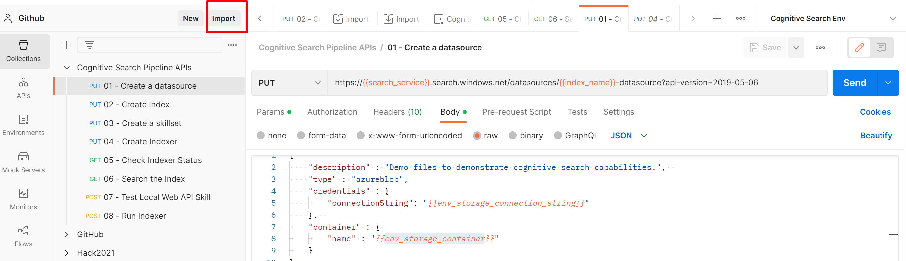
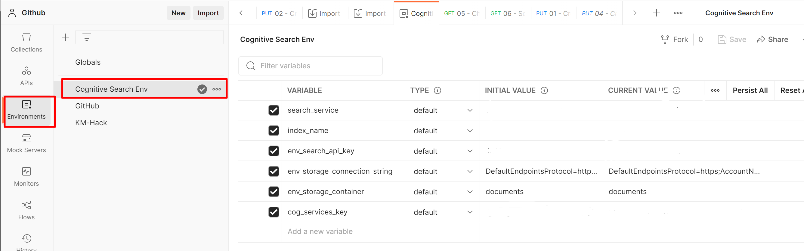

# Creating a Search Index with Postman

This folder contains a Postman collection and environment that can be used to create a search index programmatically.  Using Postman allows you to parameterize the API calls, edit the API calls to customize your pipeline, and to easily share & preserve your changes.  

This collection is pre-configured to take advantage of a majority of the out of the box Cognitive Search functionality.

We recommend using this collection to create an initial index and then iterating by editing the postman collection and adding custom skills as needed. This collection assumes that Azure Blob storage is the primary data source. Please see this [documentation](https://docs.microsoft.com/en-us/rest/api/searchservice/create-data-source) to understand the necessary changes if you wish to use a different data source.

## Prerequisites

1. Postman installed for your operating system
2. Initial document set uploaded to your Azure Blob storage container

## Setup Instructions

1. **Install Postman** - navigate to https://www.getpostman.com/apps to download and install postman for your operating system if you haven't already.
2. **Import Files** - import *Cognitive Search Pipeline APIs.postman_collection.json* and *Cognitive Search Pipeline Environment.postman_environment.json* using the Postman UI. 

    

3. **Update Environment Variables** - Set the environment using the dropdown highlighted below and then update the environment variables by selecting the *eye button* and then selecting edit. These variables are used to parameterize the API calls and save you from having to edit variables for each call. 

    

    The following variables are required:
    * **search_service** - the name of your Azure Search resource
    * **index_name** - the name of your search index; this can be whatever you want it to be
    * **env_search_api_key** - the API key for your Azure Search service; this can be found in the Azure portal
    * **env_storage_connection_string** - the connection string for your blob storage account; this can be found in the Azure portal
    * **env_storage_container** - the name of the blob container that your documents are in
    * **cog_services_key** - the key for your Cognitive services; this can be found in the Azure portal

4. **Run API Calls**
    To create a cognitive search index, run the following API calls in order:
    1. Create a datasource
    2. Create index
    3. Create a skillset
    4. Create indexer

    You can then *check the indexer status* to see if documents are processing or if there are any errors. If the indexer does not start running automatically, you can run the indexer manually.

## Additional Resources

For more help working with Postman, see the [documentation](https://learning.postman.com/docs/getting-started/introduction/) on the Postman website.
