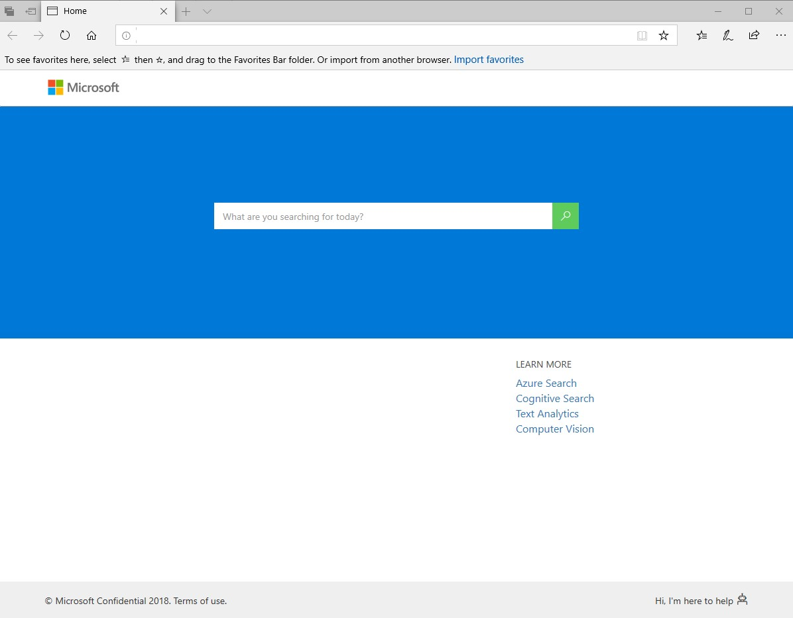
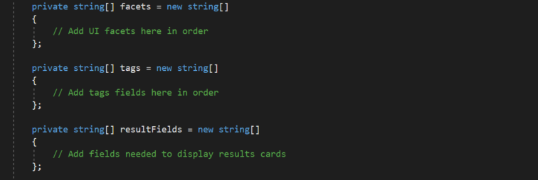

# Cognitive Search UI Template
This folder contains a basic web front end that can be used to quickly create a view of your search results.  With just a few simles steps, you can configure this template UI to query your newly created search index.

The Cognitive Search Template contains two projects:

1. **CognitiveSearch.UI** - this is a .NET Core MVC Web app used as a Template UI for querying a search index. This is the focus of this README.
2. **CognitiveSearch.Skills** - this is an Azure Function project used for creating C# custom skills. For more information on custom skills, please see the the documentation in *03 - Data Science & Custom Skills*.

In just a few steps, you can configure this template UI to query your search index. This template will render a web page similar to the following:




## Prerequisites
1. Visual Studio 2017 or newer

## 1. Update appsettings.json

Update the following fields in the *appsettings.json* file to connect the web app to your storage account, search index, and app insights account:

```json
  "SearchServiceName": "",
  "SearchApiKey": "",
  "SearchIndexName": "",
  "InstrumentationKey": "",
  "StorageAccountName": "",
  "StorageAccountKey": "",
  "StorageContainerAddress": "https://{storage-account-name}.blob.core.windows.net/{container-name}",
  "KeyField": "metadata_storage_path",
  "IsPathBase64Encoded": true,
  "GraphFacet": "keyPhrases"
```

###
*Notes*
1. *StorageContainerAddress* should be in the following format: **https://*storageaccountname*.blob.core.windows.net/*containername***
2. *InstrumentationKey* is an optional field. The instrumentation key connects the web app to Application Inisghts in order to populate the Power BI reports.
3. Key Field should be set to the field specified as a key document Id in the index.
4. Sometimes metadata_storage_path is the key, and it gets base64 encoded. In that case set IsPathBase64Encoded to false.
5. The GraphFacet is used for generating the relationship graph.


## 2. Update SearchModel.cs
At this point, your web app is configured and is ready to run. By default, all facets, tags, and fields will be used in the UI.

If you would like to further customize the UI, you can update the following fields in *Search\SearchModel.cs*. You can select the filters that you are able to facet on, the tags shown with the results, as well as the fields returned by the search.



**Facets** - Defines which facetable fields will show up as selectable filters in the UI. By default all facetable fields are included.

**Tags** - Defines which fields will be added to the results card and details view as buttons. By default all facetable fields are included.

**ResultFields** - Defines which fields will be returned in the results view. Only fields that are used for the UI should be included here to reduce latency caused by larger documents. By default all fields are included.

## 3. Add additional customization
This template serves as a great baseline for a Cognitive Search solution, however, you may want to make additional updates depending on your use case. 

### *Notes*
Much of the UI is rendered dynamically by javascript. Some important files to know when making changes to the UI are:

1. **wwroot/js/results.js** - contains the code used to render search results on the UI

2. **wwroot/js/details.js** - contains the code for rending the detail view once a result is selected

Additionally, it may be useful to know that **Controllers/HomeController.cs** contains the API calls to the search index.
