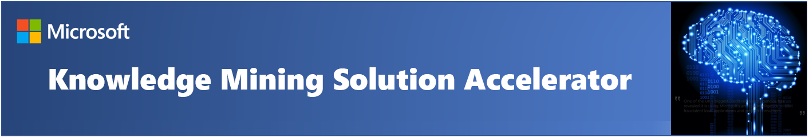
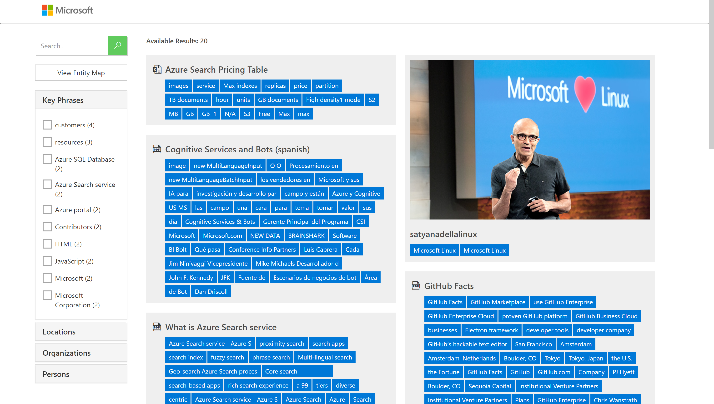
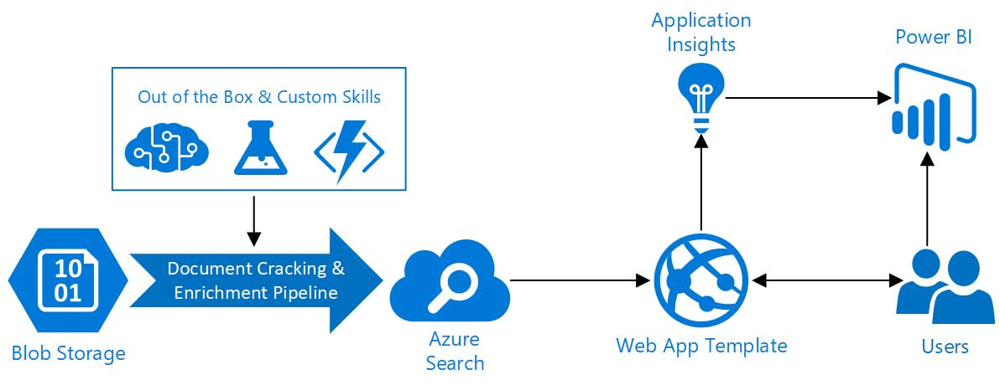

# Knowledge Mining Solution Accelerator Guide
## About this repository
Welcome to the Knowledge Mining Solution Accelerator!  This accelerator was built to provide developers with all of the resources needed to quickly build an initial Knowledge Mining prototype with [Azure Cognitive Search](https://docs.microsoft.com/en-us/azure/search/cognitive-search-concept-intro).  Use this accelerator to jump start your development efforts with your own data or as a learning tool to better understand how Cognitive Search can be leveraged for the unique needs of your business.

In this repository, we've provided you with all of the artifacts needed to quickly create a Cognitive Search Solution including: templates for deploying the appropriate Azure resources, assets for creating your first search index, templates for custom skills, a basic web app, and PowerBI reports to monitor search solution performance. We've infused best practices throughout the documentation to help further guide you.

> Note: Cognitive Search is an AI feature in Azure Search rather than a standalone product. See this [doc](https://docs.microsoft.com/en-us/azure/search/cognitive-search-concept-intro) for more information on the subject.

Once finished, you'll have a web app ready to search against your data like in the image below:

## Prerequisites
In order to successfully complete your solution, you will need to have access to and or provisioned the following:
1. Access to an Azure subscription
2. Visual Studio 2017 or newer
3. [Postman](https://www.getpostman.com/) for making API calls
4. Documents uploaded to any data source [supported by Azure Search Indexers](https://docs.microsoft.com/en-us/azure/search/search-indexer-overview).  This solution accelerator uses Azure Blob Storage as a container for source data files. Sample documents are provided in the *sample_documents* folder.

## Training
The directions provided for this repository assume fundemental working knowledge of Azure Portal, Azure Functions, Azure Search, Visual Studio and Postman.  

For additional training and support, please see:
 1. [Knowledge Mining Bootcamp](https://github.com/Azure/LearnAI-KnowledgeMiningBootcamp)
 2. [Full Cognitive Search Documentation](https://docs.microsoft.com/en-us/azure/search/cognitive-search-resources-documentation)

## Getting Started and Process Overview
Clone/download this repo onto your computer and then walk through each of these folders in order, following the steps outlined in each of the README files.  After completion of all steps, you will have a working end-to-end solution with the following architecture:

### [00 - Resource Deployment](./00%20-%20Resource%20Deployment)
The resources in this folder can be used to deploy the required resources into your Azure Subscription. This can be done either via the [Azure Portal](https://portal.azure.com) or by using the [PowerShell script](./00_Resource_Deployment/deploy.ps1) included in the resource deployment folder.  

Skip this folder if you have already provisioned the required resources or will be provisioning manually.

### [01 - Search Index Creation](./01%20-%20Search%20Index%20Creation)
This folder contains a Postman collection that can be used to create a search index. The collection is pre-configured to take advantage of a majority of the out of the box Cognitive Search functionality.

We recommend using this collection to create an initial index and then iterrating by editing the postman collection and adding custom skills as needed.

### [02 - Web UI Template](./02%20-%20Web%20UI%20Template)
This folder contains a basic Web UI Template, written in .NET Core, which can be configured to query your search index. Simply follow the steps outlined in the [Web UI Template README file](./02%20-%20Web%20UI%20Template/README.md) to integrate your new search index into the web app.

### [03 - Data Science & Custom Skills](./03%20-%20Data%20Science%20and%20Custom%20Skills)
This folder contains examples and templates to add your own custom skills to your solution. These custom skills help to align the solution to the needs of your particular use case, but is entirely optional and may be skipped if not needed.

Additional samples and information on custom skill development can be found [here](https://docs.microsoft.com/en-us/azure/search/cognitive-search-create-custom-skill-example)

### [04 - Reporting](./04%20-%20Reporting)
This folder contains optional pre-built PowerBI reports that can be used to monitor your solution and to understand user search behavior.  They leverage data captured via [Application Insights](https://docs.microsoft.com/en-us/azure/azure-monitor/app/app-insights-overview) and can be modified to meet your particular business objectives.

### [Sample Documents](./sample_documents)
This folder contains a small data set in a variety of file formats that can be used to build your solution if you do not have another data set available.

## Special Thanks
Special thanks Microsoft's Early Access innovation Program (EAiP) and to Derek Legenzoff, Christopher Romero, Lauren Mills, and Chris Lill who wrote a large majority of the code here.

## License
Copyright (c) Microsoft Corporation

All rights reserved.

MIT License

Permission is hereby granted, free of charge, to any person obtaining a copy of this software and associated documentation files (the ""Software""), to deal in the Software without restriction, including without limitation the rights to use, copy, modify, merge, publish, distribute, sublicense, and/or sell copies of the Software, and to permit persons to whom the Software is furnished to do so, subject to the following conditions:

The above copyright notice and this permission notice shall be included in all copies or substantial portions of the Software.

THE SOFTWARE IS PROVIDED AS IS, WITHOUT WARRANTY OF ANY KIND, EXPRESS OR IMPLIED, INCLUDING BUT NOT LIMITED TO THE WARRANTIES OF MERCHANTABILITY, FITNESS FOR A PARTICULAR PURPOSE AND NONINFRINGEMENT. IN NO EVENT SHALL THE AUTHORS OR COPYRIGHT HOLDERS BE LIABLE FOR ANY CLAIM, DAMAGES OR OTHER LIABILITY, WHETHER IN AN ACTION OF CONTRACT, TORT OR OTHERWISE, ARISING FROM, OUT OF OR IN CONNECTION WITH THE SOFTWARE OR THE USE OR OTHER DEALINGS IN THE SOFTWARE
