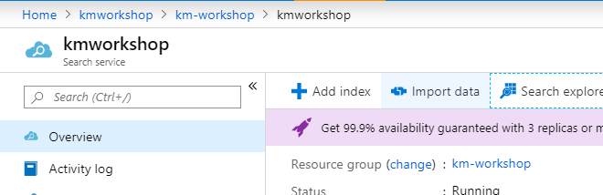
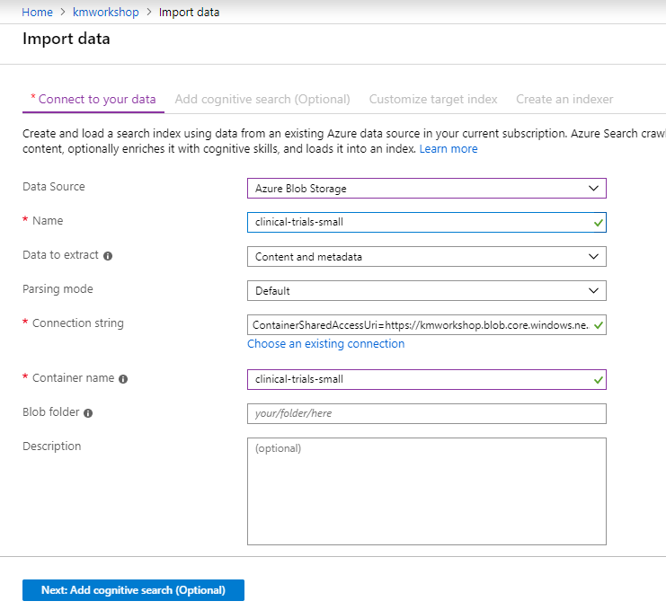
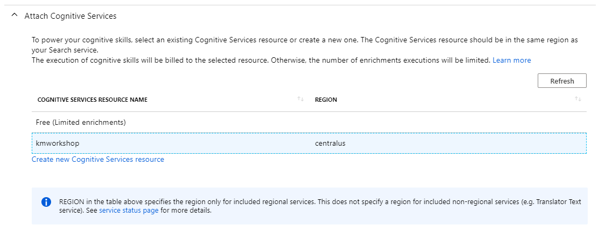
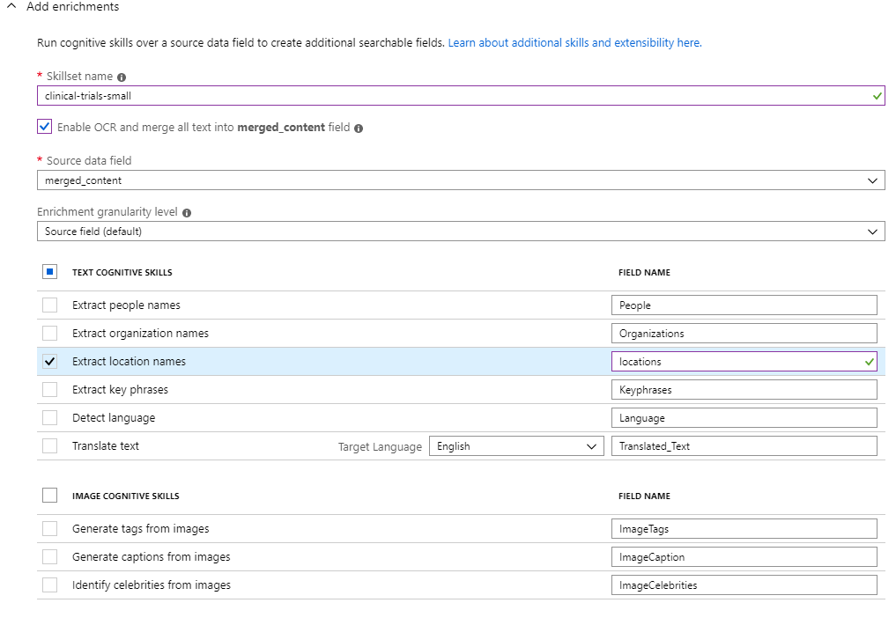
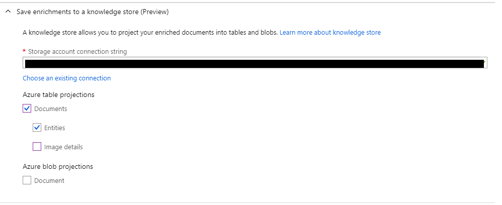
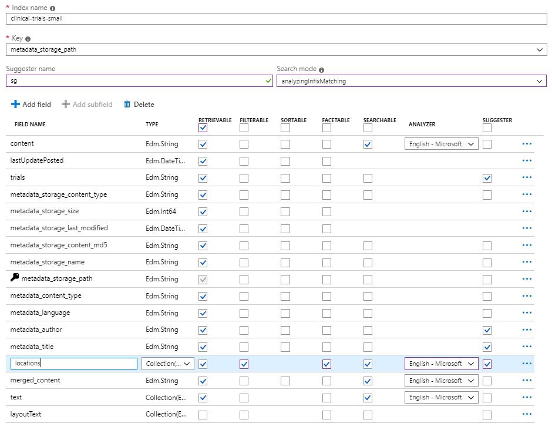
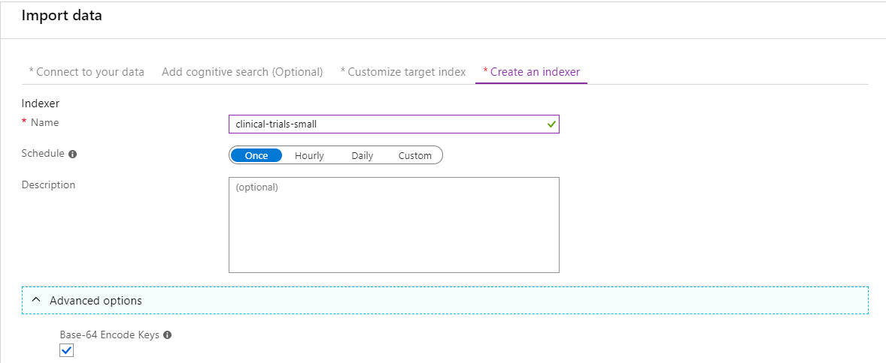
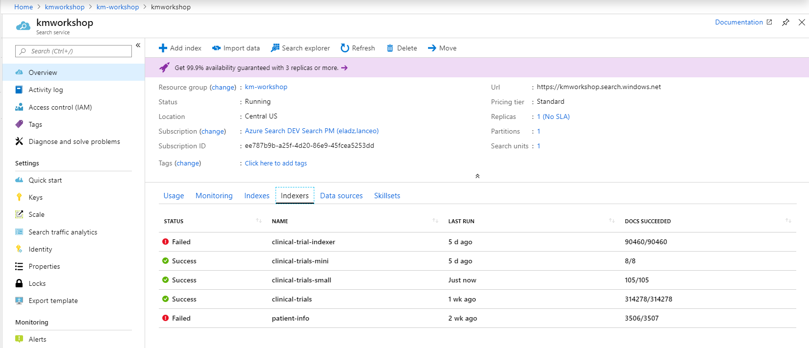
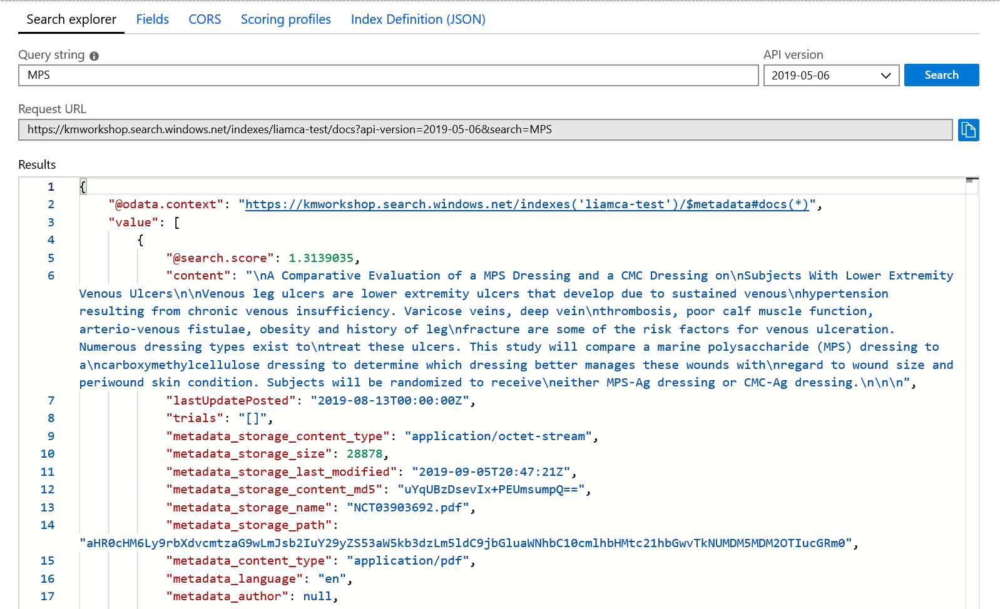
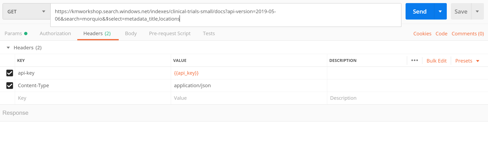

# Module 1: Using Azure Portal to Create Your Index - No Code Required

This module uses the Azure Portal to create your first Azure Search index without writing any code.  Following these steps you will: ingest a set of files (clinical-trials); extract both structured and unstructured text from those files; index their content and learn how to query your new index.  Finally, we'll use the Azure Portal to project enriched data into a Knowledge Store (new Preview capability), which we'll explore in greater detail in Module 6.

The instructions that follow assume that you have completed all of the pre-requisites found in the [ReadMe](./README.md) to this lab and have provisioned all of the necessary resources to your Azure subscription.  If you have not already completed these steps, you will need to do so prior to moving forward.

## Using the Portal Import Data Flow:


1. Navigate to your search service, and click the **Import Data** button. This will launch the Import Data Wizard which will guide you through the steps necessary to ingest your data, enrich it and create a search indexer.

   
 
1. As part of the Import Data Wizard, in the **Connect to your data** tab, you can enter the information necessary to connect to your data source.

+ In the drop down for **Data Source**, choose *Azure Blob Storage*.

+ **Name** your data source *clinical-trials-small*.

+ Set **Data to Extract** to *Content and Metadata*

+ For the **Connection String** click *Choose an existing connection* and select your storage account. Select the *clinical-trials-small* container.

    + If you're not able to find the storage account you want to use by selecting *Choose an existing connection* you can always manually add the connection string. To get your connection string, view your storage account in the Azure Portal, select *Access keys* and copy the *Connection String*. Paste this as the *Connection string*. Then add the *Container name* which will be *clinical-trials-small*.
 
   Your screen should now look similar to this:

   

+ Now click **Next** to apply cognitive skills to your data.

## Skillset

In Azure Search, we call extraction and enrichment steps cognitive skills, which are combined into a skillset referenced during indexing.  In this exercise, you will be learning how to use the [built-in skills](https://docs.microsoft.com/en-us/azure/search/cognitive-search-predefined-skills) through the Azure Portal.  In a later module, we will show you how to attach these skills programmatically and how to build your own [custom skills](https://docs.microsoft.com/en-us/azure/search/cognitive-search-custom-skill-interface).

In the next three steps, you will be working through the three drop-down arrows presented: 


### Attach the Cognitive Services 

This is the resource you created earlier as part of your initial lab set up and is used to power your pre-built AI models.



### Add enrichments

Name your skillset: *clinical-trials-small*

+ Make sure to select the **OCR enrichment** to extract **merged_content** field.

+ Now we can apply an enrichment to the merged_content field to extract the locations. Do this by checking **Extract location names**.

+ Leave all of the other enrichment boxes blank at this time as we will add in additional skills later in the lab.

   


### Save enrichments to a knowledge store (Preview) 
As you recall from the introductory session, the knowledge store is a new capability that we introduced into Public Preview in May.  Using the Knowledge Store enables you to use your data in scenarios that do not lend themselves naturally to search.  Once your data has been loaded into the Knowledge Store, you can do things like kick off RPA, run analytics or visualize in tools like PowerBI.

Projections are your mechanism for structuring data in a knowledge store. For example, through projections, you can choose whether output is saved as a single blob or a collection of related tables. An easy way to view knowledge store contents is through the built-in Storage Explorer for Azure storage.

The knowledge store supports two types of projections:

 + Tables: For data that is best represented as rows and columns, table projections allow you to define a schematized shape or projection in Table storage.

 + Objects: When you need a JSON representation of your data and enrichments, object projections are saved as blobs.

For this case, we are going to use Azure table projections 



We're going to go ahead and create the Knowledge Store now through the Azure Portal and will come back to the visualizations in a later module.

1. Under **Azure table projections**, make sure *Documents* and *Entities* have been selected. 
2. Click choose an existing connection and select your storage account.
3. Click on **+ Container** to create a new container called *clinical-trials-small-ks*.
4. **Select** the container created in the above step.

2. Click **Next: Customize the target index**.


## Index Definition
In this step, you are designing your Azure Search index.  This is an important and powerful part of the index build process as you select the types of Analyzer(s) you want to use and make determinations on features such as which fields and data will be retrievable, filterable, sortable, and searchable. 

1. Give your index a name like *clinical-trials-small*

2. Leave **Key** as the default option

3. Under **Suggester name** add sg and set **Search mode** to *analyzingInfixMatching*

4.	In the index definition fields:
      + Make sure all the fields are **retrievable**. 
      + Make sure that the locations field is **retrievable / facetable / filterable / searchable**.
      + Make sure that the lastUpdatePosted field is **retrievable / filterable / sortable**.
      + Set **English-Microsoft** as the *Analyzer* for all searchable fields since the content is in English.
      + Select **Suggester** for trials, metadata_author, metadata_title and locations
      + You can make layoutText not searchable/retrievable since we won’t need it for this workshop.

      

   5. Click on **Next: Create an indexer**.

##  Indexer Definition

1. Name the indexer *clinical-trials-small* .
2. Set the **Schedule** to Once
3. Click on the **Advanced options** drop down and note that that the index key is Base-64 encoded by default.
 
   

4. Click on **Submit**. Then wait 2 or 3 minutes or so for the indexing to occur – then go check the status of your indexer on the portal.  
 
   


   

## Searching the Content
Now that the content has been indexed, we can use the portal to test some search queries. Open the **Search explorer** and enter a search query such as "MPS" to allow us to find all document that refer to the disease MPS, and press "Search". Try adjusting the query with different phrases and terms to get an idea of the content.
 
 
 
Let's try a few additional queries:

Search for references to "Gaucher's" disease and do hit highlighting of the content where there is a reference to it:
```
gaucher&highlight=content
```
Notice as you scroll through the results that the English-Microsoft Analyzer was able to pick up variations to this phrase such as "Gaucher" and "Gaucher's" and highlights them using default <em> </em> tags.

Add a parameter &$count=true to determine that there are 8 documents that refer to "Gaucher's" disease:
```
gaucher&highlight=content&$count=true
```

### Searching the Content using Postman

The search explorer is useful for performing queries like this, however most developers want to use external tools to start working against the service.  For that reason, open Postman to perform the rest of the below search queries.  To set up the queries we will set the Headers as:
* api-key: [Enter Admin API Key from Azure Search portal]
* Content-Type: application/json

You can retrieve the API key by pulling up your search service in the Azure Portal, selecting Keys, then copying one of the available admin keys.

When we configured the Indexing of the content, we asked for locations to be extracted from the content.  Let's take a look at this by searching for morquio disease and limiting the results to only return the metadata_title, locations fields. Remember to update {name of your service} with the name of your search service.
```
GET https://{name of your service}.search.windows.net/indexes/clinical-trials-small/docs?api-version=2019-05-06&search=morquio&$select=metadata_title,locations
```

Here's what the request will look like in Postman:

 

Notice how the *locations* field is a Collection (or array of strings) that includes all the Location names extracted from the content.

Let's try to group all of the *locations* by using Faceting.
```
GET https://{name of your service}.search.windows.net/indexes/clinical-trials-small/docs?api-version=2019-05-06&search=morquio&$select=metadata_title,locations&facet=locations
```
We can see how the search results has added a list of the top locations and how often they are found in documents that talk about Morquio.

Next, let's filter the results to documents that refer to Morquio and have a Location of "Emory University"
```
GET https://{name of your service}.search.windows.net/indexes/clinical-trials-small/docs?api-version=2019-05-06&search=morquio&$select=metadata_title,locations&$filter=locations/any(location: location eq 'Emory University')
```

As a final query, we will use the autocomplete capability to suggest terms that match what a user types.  You have likely seen this in search boxes where users start typing and the system quickly suggests potential matches.  Notice how this request is a POST as opposed to a GET.

```
POST https://{name of your service}.search.windows.net/indexes/clinical-trials-small/docs/autocomplete?api-version=2019-05-06
```
Set the body of the request as "raw" and include:
```json
{
   "fuzzy": true,
   "search": "hea", 
   "suggesterName": "sg", 
   "autocompleteMode": "twoTerms"
}
```
Notice how this request uses a suggesterName called "sg".  You will recall that when you configured the index, you selected some columns to be used to power these autocomplete requests.


### Next: [Module 2: Visualizing the Results with a Demo FrontEnd](Module&#32;2.md)
