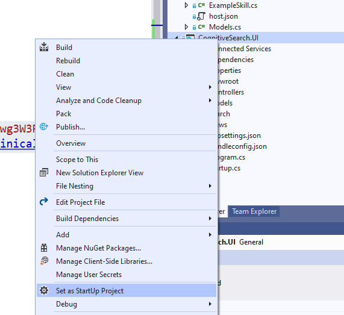

# Module 2: Visualizing the Results with a Demo FrontEnd
Now that you've built your Search index, we'll take a moment to build and deploy a simple web-page that will allow you to visualize your initial search results.  We'll come back to this view throughout the lab and take special note of how our search results change as we add additional features and capabilities.

To get started with this exercise, we will be using and getting familiar with the [Knowledge Mining solution accelerator](https://github.com/Azure-Samples/azure-search-knowledge-mining) to create our front-end experience.  This accelerator was published to provide developers with all of the steps and tools required to build a working minimally viable knowledge mining solution.  Take a few moments to note that it contains modules to: deploy the required Azure resources; build custom skills; and present the results in a simple, but elegant front-end.  At the end of this lab, your results will look similar to this:


## 1. Clone the repository
```
git clone https://github.com/Azure-Samples/azure-search-knowledge-mining.git
```

## 2. Start the project

Open **CognitiveSearch.UI.csproj** (02-Web UI Template\CognitiveSearch.UI) in Visual Studio 

## 3. Update appsettings.json

Update the following fields in the *appsettings.json* file to connect the web app to your storage account, search index, and app insights account:

```json
  "SearchServiceName": "Your Search Service Name",
  "SearchApiKey": "Your Search Service key",
  "SearchIndexName": "clinical-trials-small",
  "InstrumentationKey": "",
  "StorageAccountName": "Your storage Account Name",
  "StorageAccountKey": "Your Storage Account Key",
  "StorageContainerAddress": "Your Storage Container Address",
  "KeyField": "metadata_storage_path",
  "IsPathBase64Encoded": true,
  "GraphFacet": "diseases"
```
 
### Notes
1. **SearchServiceName** should be set to the name of the search service. (i.e. "myservice")
1. **SearchApiKey** should be to the name of the search service. (i.e. "B8365AC95521089B7E3FA4CC98435")
1. **SearchIndexName** should be set to the name of the index (i.e. "clinical-trials-small")
1. **StorageAccountName** should be set to the name of the storage account (i.e. "mystorageaccount")
1. **StorageContainerAddress** should be in the following format: *"https://*storageaccountname*.blob.core.windows.net/*containername*"*
1. **InstrumentationKey** is an optional field. The instrumentation key connects the web app to Application Insights in order to populate the Power BI reports.
1. **KeyField** should be set to the field specified as a key document Id in the index. (i.e. "metadata_storage_path")
1. Sometimes metadata_storage_path is the key, and it gets base64 encoded. In that case set **IsPathBase64Encoded** to true.
1. The **GraphFacet** is used for generating the relationship graph, set it to the name of the facet that you would like to use (i.e. "diseases"). Or leave blank if you won't use the node graph.


###
*Important:* 
While this tutorial is optimizing for efficiency of allowing you to see results, and investigate the code, please note that entering your credentials into code is not a good practice to follow. We recommend you use a service like [Azure Key Vault](https://docs.microsoft.com/en-us/azure/key-vault/key-vault-overview) to do this.

## 3. Set the **Startup Project**
 
 
 
## 4. Run the project and see the results
 


## 5. Inspect the code

Much of the UI is rendered dynamically by javascript. Some important files to know when making changes to the UI are:

1. **wwroot/js/results.js** - contains the code used to render search results on the UI

2. **wwroot/js/details.js** - contains the code for rending the detail view once a result is selected

### Next: [Module 3: Introduction to Azure Functions and Custom Skills](Module&#32;3.md)

