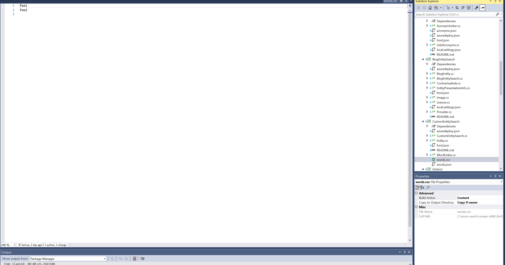
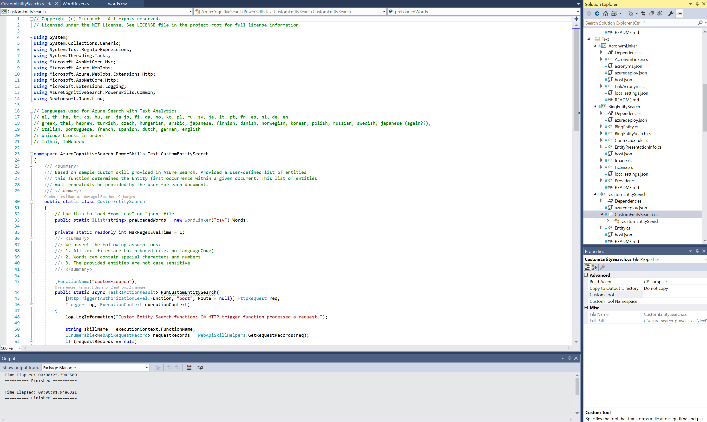
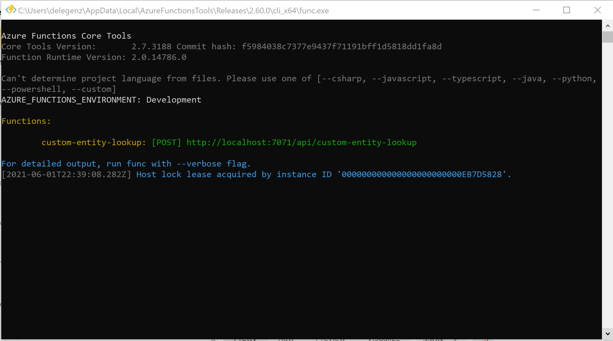
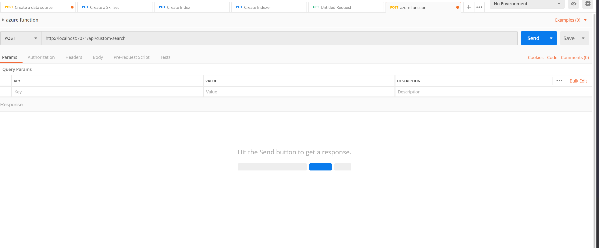
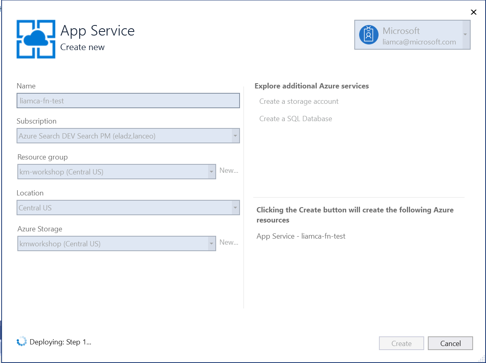
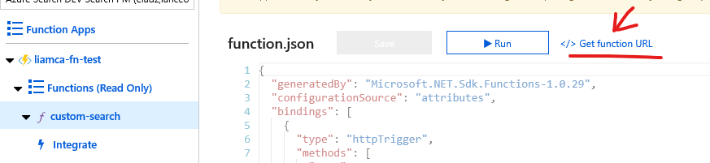

# Module 3: Introduction to Azure Functions and Custom Skills
Objective: Introduce the tools and provide concepts key to building [custom skills](https://docs.microsoft.com/en-us/azure/search/cognitive-search-custom-skill-interface). Building a custom skill gives you a way to insert transformations unique to your content. A custom skill executes independently, applying whatever enrichment step you require and allowing you to develop extremely powerful and domain specific knowledge mining solutions.  

In this module we will develop a custom skill to extend the data that was indexed in the previous module.  Your new skill will identify and extract disease names from the data set and store them as entities in a separate field attached to the document.  By doing this, it will allow us to leverage capabilities such as:

1) Leveraging [facets](https://docs.microsoft.com/en-us/azure/search/search-filters-facets) to show the diseases and their counts that are mentioned in the corpus of search results
2) [Filtering](https://docs.microsoft.com/en-us/azure/search/search-filters) documents that refer to a specific disease

To do this, we will leverage a "[Custom Skill](https://docs.microsoft.com/en-us/azure/search/cognitive-search-custom-skill-web-api)" built using Azure Functions that will be called by Cognitive Search with the text from the underlying document. The function will process this text and respond with the entities found in that text.  These entities will then be stored in a separate Azure Search Collection field.

We will also be using some of the released [Power Skills](https://azure.microsoft.com/en-us/resources/samples/azure-search-power-skills/).  Power Skills are simply a collection of useful functions to be deployed as custom skills for Azure Cognitive Search that we have made available to accelerate development.  Check this repository frequently as new updates to the Power Skill set will be released.

## Creating the Azure Function

The Azure Function will use a "dictionary" based technique to search the underlying text and respond with any terms or phrases that match what is stored in the dictionary.  With advances in ML and AI, there are much more advanced methods for doing this type of "named entity extraction", however in many cases this method often works quite well and is very simple to implement.  

To get started, we will clone the [Azure Search Power Skill](https://github.com/Azure-Samples/azure-search-power-skills) github repository: 
```
  git clone https://github.com/Azure-Samples/azure-search-power-skills.git
```
Once you have downloaded this repository, open up the solution in Visual Studio.  

In the Solution Explorer, locate the project "CustomEntitySearch" under the **Text** folder and open the **words.csv** file.



We are going to place our own dictionary of disease names into this file.    

Open [words.csv](./data) in your browser. It is located in the /data folder of this project. Copy the contents of that csv. Open the **words.csv** in your Visual Studio project and replace the existing content with the content that you just copied.

  *NOTE: [words.csv](./data) is a small dictionary that is not fully vetted but it is more than adequate for the purposes of this lab*.

## Walking through the Azure Function code

The main code for this function can be found in the following two files

### WordLinker.cs

If you open this file, you will find a function called *WordLinker* which receives a file type of json or csv.  In the above step we applied the dictionary to a CSV file and as such this function will be loading this file into memory to be used by the function.

### CustomEntitySearch.cs

CustomEntitySearch is one of the Power Skill functions mentioned earlier.  Spend a bit of time walking through the code as there are a few interesting things to see in this file: 



1) First you will notice that the above WordLinker function is used to populate a List called *preLoadedWords*.
2) Next, in the *RunCustomEntitySearch* function, we can see that the user can actually supply the set of words they want to use in the API call (inRecord.Data.ContainsKey("words")).  If there is not a supplied list, the *preLoadedWords* will be used.
3) A Regular Expression based mechanism is used to iterate through the text sent by the users to find phrases that match those of the dictionary.  
4) The function returns a JSON document that contains both a set of unique EntitiesFound as well as the individual Entities with their text location.

## Testing the Azure Function

We will first test the application locally.  

1) Right click on CustomEntitySearch in the Solution Explorer and choose "Set as StartUp Project"
2) Press F5 - NOTE: You may need to allow the function to run
3) Once the function is running it should supply you with the URL to use for POST calls.  Copy this URL.




4) Open PostMan and click on **New** to create a new Request (you can add this to any collection you'd like)
5) Enter the URL copied and change the request type from GET to POST.



5) Click **Body** and below that choose **raw** and paste in the following JSON:

```json
  {
    "values": [
        {
            "recordId": "1",
            "data":
            {
                "text":  "This is a 53-year-old man with diabetes, morbid obesity, hepatitis C, and cirrhosis."
            }
        }
    ]
}
```

6) Press Send and you should get a response that looks like the following.  This is the format that the Azure Search Indexer expects to receive and will form the basis of the response for this Custom Skill.


```json
{
    "values": [
        {
            "recordId": "1",
            "data": {
                "Entities": [
                    {
                        "name": "cirrhosis",
                        "matchIndex": 74
                    },
                    {
                        "name": "diabetes",
                        "matchIndex": 31
                    },
                    {
                        "name": "hepatitis",
                        "matchIndex": 57
                    },
                    {
                        "name": "hepatitis C",
                        "matchIndex": 57
                    },
                    {
                        "name": "obesity",
                        "matchIndex": 48
                    }
                ],
                "EntitiesFound": [
                    "cirrhosis",
                    "diabetes",
                    "hepatitis",
                    "hepatitis c",
                    "obesity"
                ]
            },
            "errors": [],
            "warnings": []
        }
    ]
}
```
7) Optionally you can set breakpoints on the Azure Function app to get a better idea on how it works
8) Return to Visual Studio and stop the running project.

## Deploy the Azure Function

Now that we have a working Azure Function, we will deploy it to Azure.  

  *NOTE: If you prefer not to create your own resource (and resulting costs), you can skip this section and simply use a pre-deployed function located at https://diseaseextraction.azurewebsites.net/api/custom-search?code=HXS0y4rEoQZ9p55A7wqybSeYFmYP6Lruna8y8HoAGu3kNSoLf80XWw==

To create your own Azure Function:
1) In Solution Explorer, right click on the CustomEntitySearch project and choose: Publish
2) Choose "Azure Functions Consumption Plan"
3) Choose "Create New" and click "Publish"
4) This will launch a page to load your subscription (or request you log in to your subscription)



5) After it has deployed, open the [Azure Portal](https://portal.azure.com) and locate this Azure Function.
6) Choose "Get Function URL" and copy the full URL (including the code parameter)



7) Go back to Postman and replace the previous localhost request, with this new URL and press Send.  You should get the exact same result as above.

## Azure Functions - Production vs Demo
There are a number of items used above that are useful for development purposes, however not for production usage.  A few examples of this include:
* Usage of the "code=" parameters in the above Azure Function is not a best practice for production, however, it is very convenient for development
* We manually published the function, however, in production scenarios it would be far more realistic to leverage a Continuous Integration method of deployment
* In the configuration of the function, we chose a consumption plan.  For production, you would want to take a closer look at usage, so that you can adjust the scale of the function, which very likely could be higher and might require a dedicated or scaled out environment.

### Next: [Module 4: Learn the Object Model](Module&#32;4.md)
