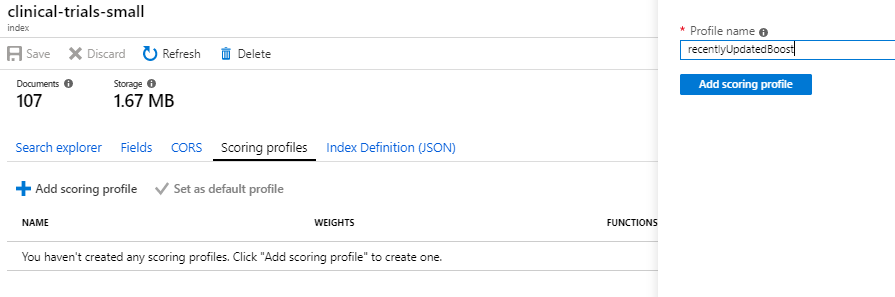
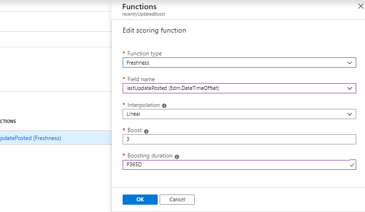

# Module 5: Advanced Azure Cognitive Search

In this module we are going to cover two advanced search topics:
* Custom Analyzers 
* Scoring Profiles

## Custom Analyzers

In the previous module, we created an index that contained a field called diseases which allowed us to not only search this field, but also facet (categorize documents) and filter documents based on whether they contain specific diseases.  One of the challenging things with diseases is they are often really hard to spell.  Take the rare disease "mucopolysaccharidosis".  You could imagine that when people search for this, they could do a really poor job of spelling it.  Perhaps they might type "mukopolisakaridosis".  Although search allows you to handle [simple spelling mistakes](https://docs.microsoft.com/en-us/azure/search/query-lucene-syntax#bkmk_fuzzy
), this is far more than a simple spelling mistake. From a user perspective, it would be incredibly frustrating to get 0 results.  Luckily there are ways that we can accommodate this through the use of custom analyzers.  Specifically what we will be creating is a "Phonetic" [custom analyzer](https://docs.microsoft.com/en-us/azure/search/index-add-custom-analyzers) that allows the search engine to match on words that sounds phonetically similar.  That would allow users to type "mukopolisakaridosis", yet find matches where the diseases stored is "mucopolysaccharidosis".  

You might imagine numerous examples of where phonetic search could help including:
* People names (for example Cavanagh vs. Kavanaugh)
* Audio Transcription Mistakes (for examples SQL being transcribed as sequel)

Azure Cognitive Search provides various phonetic encoders that will encode words in different ways.  The one we will use is called doubleMetaphone and this encodes both mukopolisakaridosis and mucopolysaccharidosis to a code of MKPL.  Since it is stored in the index as MKPL, when someone searches for either mukopolisakaridosis or mucopolysaccharidosis, they both get encoded to the same value and as a result you get a match.

### Adding a Phonetic field to the Index
Let's modify the index like we did in the previous module to add a new field called diseasesPhonetic which makes use of the Phonetic Custom Analyzer.

Go back to your Postman application and bring up the PUT request where you last updated the index with the diseases field.  If you do not have it there, you should be able to find it in the History requests.

Modify the PUT request by adding the following field:
```json
"fields": [
   ...,
 {
	"name": "diseasesPhonetic",
	"type": "Collection(Edm.String)",
	"searchable": true,
	"filterable": true,
	"retrievable": true,
	"sortable": false,
	"facetable": true,
	"key": false,
	"indexAnalyzer": null,
	"searchAnalyzer": null,
	"analyzer": "my_phonetic",
	"synonymMaps": []
}...
]
```
Notice the field uses an analyzer called "my_phonetic".  This will be the custom analyzer that we will need to create.  For this, find "analyzers": [] and replace it with:
```json
  "analyzers": [
    {"name":"my_phonetic","@odata.type":"#Microsoft.Azure.Search.CustomAnalyzer","tokenizer":"microsoft_language_tokenizer","tokenFilters": [ "lowercase", "asciifolding", "phonetic_token_filter" ]}
  ],

```

Locate "tokenFilters": [] and replace it with:
```json
"tokenFilters":[  
  {  
	  "name":"phonetic_token_filter",  
	  "@odata.type":"#Microsoft.Azure.Search.PhoneticTokenFilter",  
	  "encoder":"doubleMetaphone"
  }],
```

Since we are making incremental changes to the index schema we need to modify the PUT request by adding:
```
&allowIndexDowntime=true
```
Hit send to update the index

We need to update the indexer so that it knows to take the diseases and also write it to this new field.

Bring up the PUT request where you last updated the indexer with the diseases output field mapping.  If you do not have it there, you should be able to find it in the History requests.

Add this outputFieldMapping to the indexer.

```json
{
	  "sourceFieldName": "/document/diseases/*/name",
	  "targetFieldName": "diseasesPhonetic",
	  "mappingFunction": null
}
```
Hit send to update the indexer and go back to the portal.

In the portal, **RESET** the indexer and re **RUN** the indexer again.

 

### Testing the Analyzer
You can validate what this encoding looks like by executing the following two requests using the Azure Cognitive Search Analyze API against your search index and the phonetic analyzer "my_phonetic" that was created in the previous module.:

```
POST: https://{name of your service}.search.windows.net/indexes/[search index]/analyze?api-version=2019-05-06
BODY:
{
  "text": "mucopolysaccharidosis",
  "analyzer": "my_phonetic"
}
```
and
```
POST: https://{name of your service}.search.windows.net/indexes/[search index]/analyze?api-version=2019-05-06
BODY:
{
  "text": "mukopolisakaridosis",
  "analyzer": "my_phonetic"
}
```

Notice how both result in a token with the value: MKPL.

```json
{
   "token": "MKPL",
   "startOffset": 0,
   "endOffset": 21,
   "position": 0
}
```

Try sending various different words and phrases to see how they get encoded.

There are a lot of other intersecting custom analyzers and tokenizers that can be used such [Regular Expression](https://docs.microsoft.com/en-us/azure/search/index-add-custom-analyzers#property-reference) (RegEx) that allows you to leverage patterns to find distinct tokens.  

## Ranking using Scoring Profiles

Azure Cognitive Search uses a number of textual based factors to determine what are the most relevant documents to send back. This is primarily based on an algorithm called TF/IDF. Term Frequency (TF) looks at how often a query term matches in a single document. Inverse Document Frequency (IDF) looks at how often a query term matches in many documents (common examples include "is" "or" "the").

In some cases, the ranking of results that Azure Cognitive Search provides by default are not optimal. For example, what if in the past year there have been recent developments in treating the morquio disease so a user wants to search for clinical trials that discuss the "morquio" disease and they are mostly interested in clinical trials that have been updated in the past year? The default ranking of results does not take into account each clinical trial's lastUpdatePosted field.

Luckily you have a lot of control over this in Azure Cognitve Search. One way to handle this scenario might be to order results in descending order by the lastUpdatePosted field since we've made that field Sortable in the index. While sorting by a particular field is useful in some scenarios, this might give us clinical trials at the top of the list that aren't as relevant as results lower down the list even though they were recently updated.

Another way to handle this is to create what is called a [scoring profile](https://docs.microsoft.com/en-us/azure/search/index-add-scoring-profiles). You can have one or more scoring profiles created for a search index and each scoring profiles has a set of weights and functions that can be used to adjust the default scoring (and resulting ordering) of the search results. For our example, we might want to use a scoring profile with the freshness function. By using the freshness function, we can boost the score of clinical trials that have a lastUpdatePosted date within the last year.

Let's create a scoring profile for this.

* Open the Azure Portal and choose your Index
* Choose Scoring Profiles and choose "Add Scoring Profile"
* Name it "recentlyUpdatedBoost" and choose "Add Scoring Profile" to save it

  
 
* In the resulting scoring profile, choose "Add functions"
* Select "Add scoring function"
* Set the Function type to "Freshness"
* Set the Field name to "lastUpdatePosted"
* Set the Interpolation to "Linear"
* Set a Boost value of 3
* Set the Boosting duration to "P365D"
* Click OK, then click OK again
* Click Save to save this updated scoring profile

 
 
### Notes
1. The "Freshness" function is used when you want to boost based on a datetime field in the index.
1. Interpolations allow you to set the shape of the slope used for scoring.
1. The boost value is a positive number used as multiplier for raw score.
1. The boosting duration sets an expiration period after which boosting will stop for a particular document. In this example we've set it to 365 days.

Next, open the Search Explorer and try a few queries with and without this scoring profile:

```
&scoringProfile=recentlyUpdatedBoost
```

There are a number of additional functions that can be used to adjust the scoring of search results which we will not be covering including:

- magnitude should be used when you want to boost based on how high or low a numeric value is. Scenarios that call for this function include boosting by profit margin, highest price, lowest price, or a count of downloads. This function can only be used with double and integer fields.
For the magnitude function, you can reverse the range, high to low, if you want the inverse pattern (for example, to boost lower-priced items more than higher-priced items). Given a range of prices from $100 to $1, you would set boostingRangeStart at 100 and boostingRangeEnd at 1 to boost the lower-priced items.
- distance should be used when you want to boost by proximity or geographic location. This function can only be used with Edm.GeographyPoint fields.
- tag should be used when you want to boost by tags in common between documents and search queries. This function can only be used with Edm.String and Collection(Edm.String) fields.

### Next: [Module 6: Analyzing extracted data with PowerBI](Module&#32;6.md)
