# Module 6: Analyzing extracted data with PowerBI
Objective: Now that we projected information to the Knowledge Store, this structured data could be useful in scenarios that go beyond Search. In this module we’ll connect the table projections we created to PowerBI and create a few sample graphs with the extracted data

Let's look at the tables we created when we built the Knowledge Store in module 1:

We see two tables, one for the documents and another one for each of the entities identified in those documents 

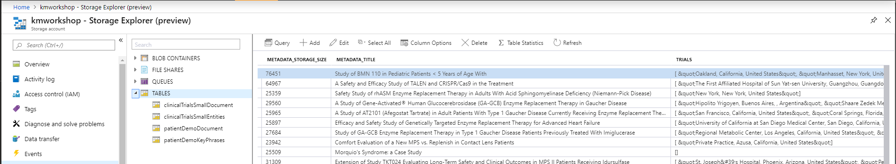

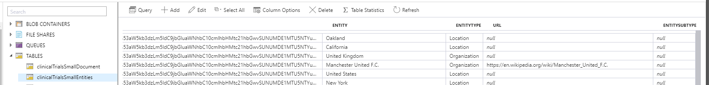

Now that we projected information to the Knowledge Store, this structured data could be useful in scenarios that go beyond Search.  This data could be useful for analytics, to train an ML model, or simply to maintain a cache of any extractions we produced. In this module we’ll connect the table projections we created to PowerBI and create a few sample graphs with the extracted data.

# Analyzing extracted data with PowerBI

1.	Run **PowerBI Desktop** and click **Get Data**.
 
    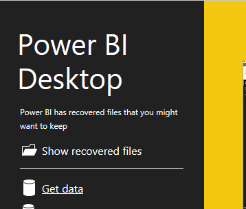
 
2.	Select **Azure** > **Azure Table Storage**, and enter **your account** name.  (This is the name you gave your Azure Storage Account in module 1)
 
    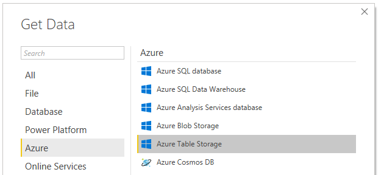
 
    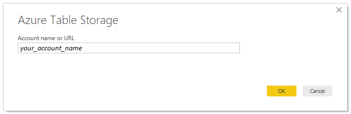
 
3.	When prompted, enter the key to your storage account.  You will find this in the Azure Portal as shown below.

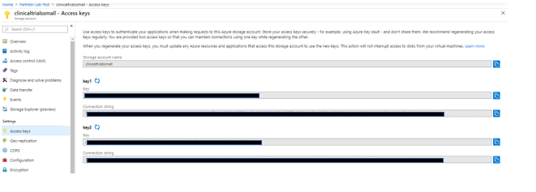

4.	Select the 3 tables we just produced, and click **Load**.
 
    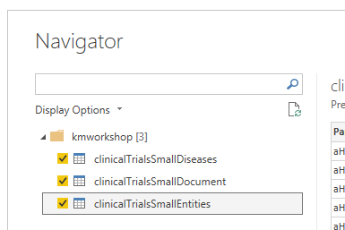
 
5.	Open **Power Query** by clicking the **Edit Queries** command.
 
    
 
    For each of the tables:
    + Remove the **PartitionKey**, **RowKey**, and **Timestamp** columns created by Azure Table storage. Just right click on the Column name, and click **Remove**.  Knowledge store provides relationships used in this analysis.       

    + Expand the **Content** field by clicking the little expand icon on the right of the Content Column.  Select all columns, and uncheck “Use original column name as prefix” as shown below.
 
        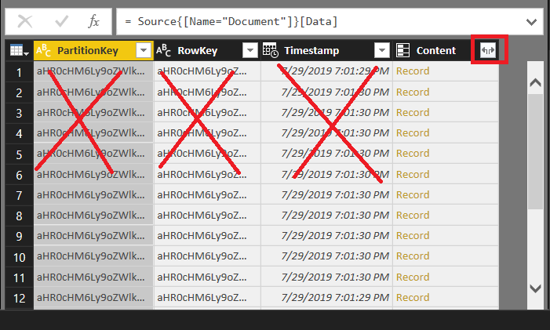
        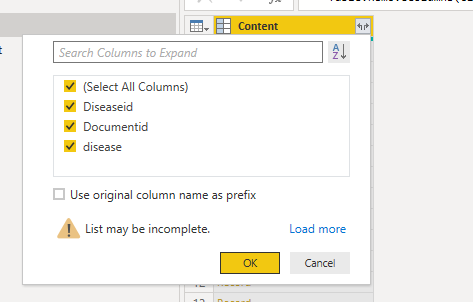

    Remember to do this operation for three of the tables.  
 
7.	Change the type of **lastUpdatePosted** in the **Document table** to be of type **Date**.
 
    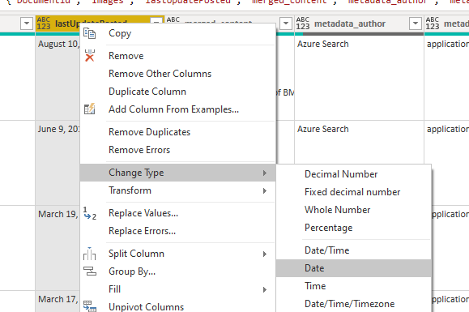

8.	Then click **Close and Apply**
 
    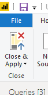

 
9.	Now, we’ll change the relationships so they are bidirectional, this will help us filter the documents whenever we select a disease or a location.
   
+ Click on the Model tab 

    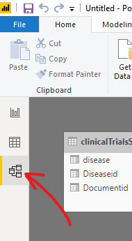

+ Change the relationships so they are bidirectional. Double click the relationships arrow, then you will see the Edit relationships dialog, and set *Cross Filter Direction* to **Both**. Perform this action for both cases (*Document* <--> *Disease* and *Document* <--> *Entities*)

    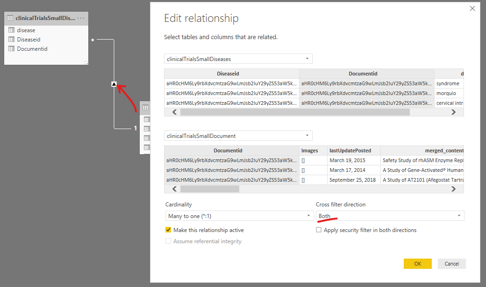

10.	Back on the **Report** tab we will create a few visualizations. Let’s start by creating a table that shows all the entities. Click the table icon, and then drag *disease* into the **Values** field. 

    

    The table  should look like this: 

    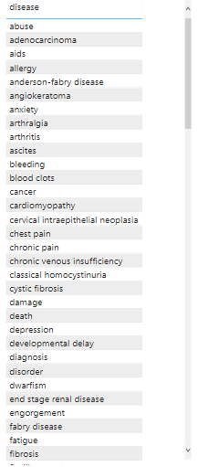
 
11. Let’s add a visualization that shows the incidences of clinical trials over time. 

Add a **Stacked column chart**. For the *Axis* pick the *lastUpdatePosted* field, and select it’s **Date Hierarchy**. 

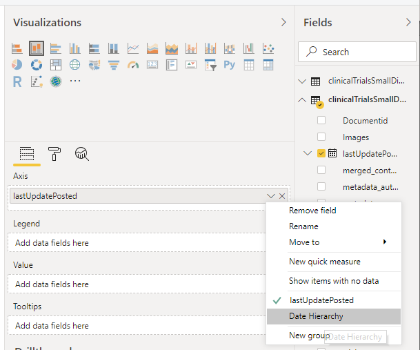

Then remove **quarter**, **month** and **day** since we only care about the year the clinical trial happened. 

For the value axis, select **Count (DocumentId)** – this will allow us to graph the number of distinct trials per year. You can do this by simply dragging **DocumentId** field into the **Value** field. 

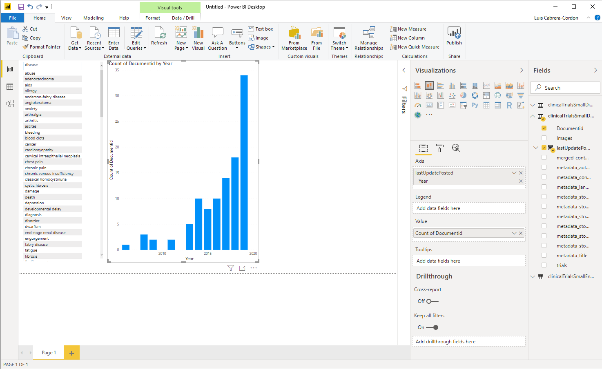

When you select a disease in the diseases table, you should now be able to see the clinical trials that mention that term for any given year. For instance, selecting *mucopolyyssacharidosis*, you should be able to see that there has been an increase in research in this area over the last decade:

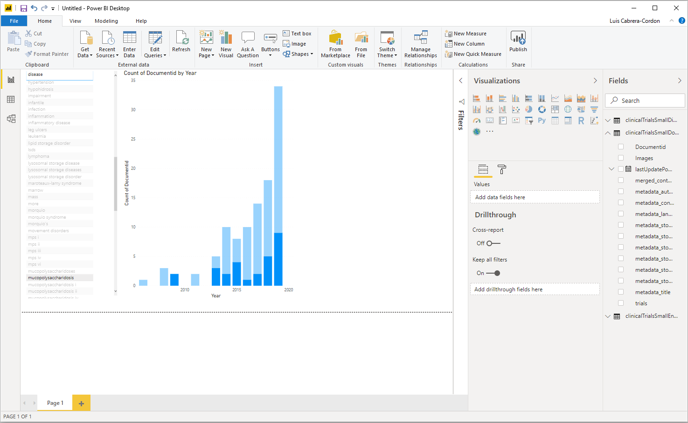
 
13. Add a Filled Map Visualization to identify the different countries and research locations for the clinical trials. For the *Location*, select *Entity*, but filter the *Entities* to only *Location Entities*.

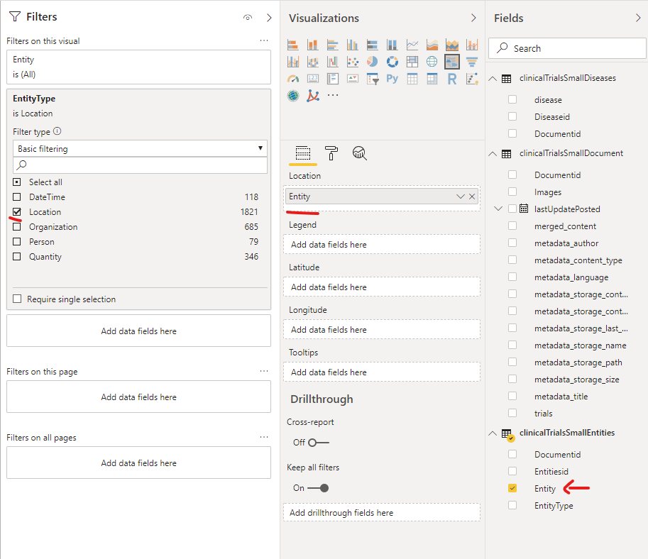
 
14. Just for completeness, we’ll add one more table to show us the title of the clinical trials based on our current location/time filter. Select a **Table** visualization, and add **metadata_title** and **lastUpdatePosted** fields from the **clinicalTrialsSmallDocument** table as the Values to visualize, as shown below. 
 
    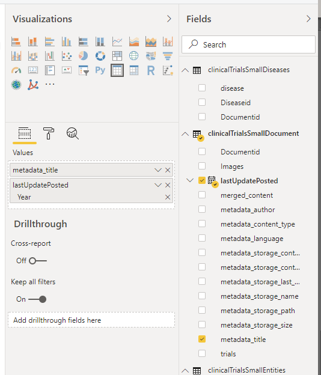

    By now, your Report should look like this:

    

Congratulations! Now you have an interactive report. Here are a few fun exercises you could do:

1.	Click over the different years to see how research has evolved over the years in this data set. For instance, you will be able to see that research for *MPS* has actually become more global over the years for instance.

2.	Select a particular disease like *“Hypohidrosis”* and quickly see where the researchers that did that clinical-trial are located. 

3.	Try building your own visualization – notice there are many interesting visualizations in the Visualizations Marketplace.  Here is one we created with the Force-Directed-Graph Visualization to find documents that connect different diseases.
 
    

### Next: [Optional: Module 7: Indexing data from Azure SQL](Module&#32;7.md)

