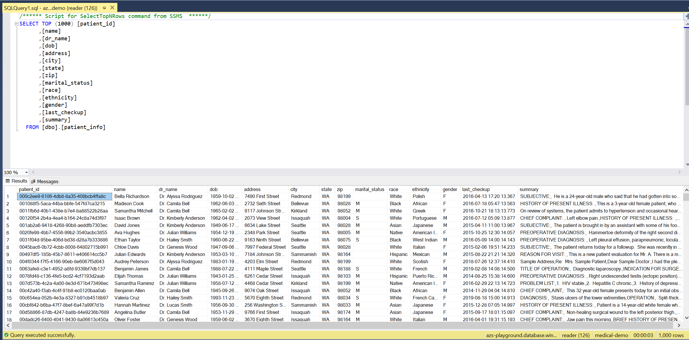

# Optional: Module 7: Indexing data from Azure SQL

In the past modules, we focused on indexing content from unstructured sources such as PDF's.  Often, there is a lot of data that exists in structured data sources such as Azure SQL or Cosmos DB which could benefit from the ability to perform full-text search.  The advantage here, is that unlike unstructured data such as PDF's, the data has already been structured so we can make use of this through faceting and filtering.  Yet, still there is often text content that can benefit from "enrichment".  

In the below module you will take a set of purely anonymized patient data (patient name, address, notes, etc) and index it into Azure Cognitive Search.  Just like in the previous module, we will leverage the Custom Skill to extract diseases from the patient notes and then create a resulting application to search the patient information.

## SQL Database Connection Information

If you happen to have SQL Server Management Studio, you can connect to the Azure SQL database that holds the data will be indexing, however that is not required for this module.  To connect to the database you will use the following information from https://azsplayground.blob.core.windows.net/public/medical-demo-connection-string.txt.  Keep in mind that one should normally guard your username/password for SQL authentication closely.  In this case, we are intentionally sharing account information for read-only access to support this public demo.  

```
Server: azs-playground.database.windows.net
Database: medical-demo
User: reader
Password: (see the value in [https://azsplayground.blob.core.windows.net/public/medical-demo-connection-string.txt](https://azsplayground.blob.core.windows.net/public/medical-demo-connection-string.txt))
Table: patient_info
```

Here is what the data looks like:

 

## Indexing Content into Azure Cognitive Search

Just as we did in Module 3, we will leverage Postman to create the Data Source, Skillset, Indexer and Index to hold the data.  You could alternatively use the Portal, however, you will not be able to configure the Custom Skill for extracting diseases as the ability to do this in not yet available in the portal.

### Create the Index
Replace the [searchservice] with your search service and use your admin api key in the header.

PUT: https://[searchservice].search.windows.net/indexes/patient-info?api-version=2019-05-06

Headers:
* Content-Type: application/json
* api-key: [your admin api-key]

Body:
```json
{
    "name": "patient-info",
    "defaultScoringProfile": "",
    "fields": [
        {
            "name": "patient_id",
            "type": "Edm.String",
            "searchable": false,
            "filterable": false,
            "retrievable": true,
            "sortable": false,
            "facetable": false,
            "key": true,
            "indexAnalyzer": null,
            "searchAnalyzer": null,
            "analyzer": null,
            "synonymMaps": []
        },
        {
            "name": "name",
            "type": "Edm.String",
            "searchable": true,
            "filterable": false,
            "retrievable": true,
            "sortable": false,
            "facetable": false,
            "key": false,
            "indexAnalyzer": null,
            "searchAnalyzer": null,
            "analyzer": "en.microsoft",
            "synonymMaps": []
        },
        {
            "name": "dr_name",
            "type": "Edm.String",
            "searchable": true,
            "filterable": true,
            "retrievable": true,
            "sortable": false,
            "facetable": true,
            "key": false,
            "indexAnalyzer": null,
            "searchAnalyzer": null,
            "analyzer": "standard.lucene",
            "synonymMaps": []
        },
        {
            "name": "dob",
            "type": "Edm.DateTimeOffset",
            "searchable": false,
            "filterable": true,
            "retrievable": true,
            "sortable": false,
            "facetable": true,
            "key": false,
            "indexAnalyzer": null,
            "searchAnalyzer": null,
            "analyzer": null,
            "synonymMaps": []
        },
        {
            "name": "address",
            "type": "Edm.String",
            "searchable": true,
            "filterable": false,
            "retrievable": true,
            "sortable": false,
            "facetable": false,
            "key": false,
            "indexAnalyzer": null,
            "searchAnalyzer": null,
            "analyzer": "standard.lucene",
            "synonymMaps": []
        },
        {
            "name": "city",
            "type": "Edm.String",
            "searchable": true,
            "filterable": true,
            "retrievable": true,
            "sortable": false,
            "facetable": true,
            "key": false,
            "indexAnalyzer": null,
            "searchAnalyzer": null,
            "analyzer": "standard.lucene",
            "synonymMaps": []
        },
        {
            "name": "state",
            "type": "Edm.String",
            "searchable": true,
            "filterable": true,
            "retrievable": true,
            "sortable": false,
            "facetable": true,
            "key": false,
            "indexAnalyzer": null,
            "searchAnalyzer": null,
            "analyzer": "standard.lucene",
            "synonymMaps": []
        },
        {
            "name": "zip",
            "type": "Edm.String",
            "searchable": true,
            "filterable": true,
            "retrievable": true,
            "sortable": false,
            "facetable": true,
            "key": false,
            "indexAnalyzer": null,
            "searchAnalyzer": null,
            "analyzer": "standard.lucene",
            "synonymMaps": []
        },
        {
            "name": "marital_status",
            "type": "Edm.String",
            "searchable": false,
            "filterable": true,
            "retrievable": true,
            "sortable": false,
            "facetable": true,
            "key": false,
            "indexAnalyzer": null,
            "searchAnalyzer": null,
            "analyzer": null,
            "synonymMaps": []
        },
        {
            "name": "race",
            "type": "Edm.String",
            "searchable": false,
            "filterable": true,
            "retrievable": true,
            "sortable": false,
            "facetable": true,
            "key": false,
            "indexAnalyzer": null,
            "searchAnalyzer": null,
            "analyzer": null,
            "synonymMaps": []
        },
        {
            "name": "ethnicity",
            "type": "Edm.String",
            "searchable": false,
            "filterable": true,
            "retrievable": true,
            "sortable": false,
            "facetable": true,
            "key": false,
            "indexAnalyzer": null,
            "searchAnalyzer": null,
            "analyzer": null,
            "synonymMaps": []
        },
        {
            "name": "gender",
            "type": "Edm.String",
            "searchable": false,
            "filterable": true,
            "retrievable": true,
            "sortable": false,
            "facetable": true,
            "key": false,
            "indexAnalyzer": null,
            "searchAnalyzer": null,
            "analyzer": null,
            "synonymMaps": []
        },
        {
            "name": "last_checkup",
            "type": "Edm.DateTimeOffset",
            "searchable": false,
            "filterable": true,
            "retrievable": true,
            "sortable": false,
            "facetable": true,
            "key": false,
            "indexAnalyzer": null,
            "searchAnalyzer": null,
            "analyzer": null,
            "synonymMaps": []
        },
        {
            "name": "summary",
            "type": "Edm.String",
            "searchable": true,
            "filterable": false,
            "retrievable": true,
            "sortable": false,
            "facetable": false,
            "key": false,
            "indexAnalyzer": null,
            "searchAnalyzer": null,
            "analyzer": "en.microsoft",
            "synonymMaps": []
        },
        {
            "name": "diseases",
            "type": "Collection(Edm.String)",
            "searchable": true,
            "filterable": true,
            "retrievable": true,
            "sortable": false,
            "facetable": true,
            "key": false,
            "indexAnalyzer": null,
            "searchAnalyzer": null,
            "analyzer": "en.microsoft",
            "synonymMaps": []
        }
    ],
    "scoringProfiles": [],
    "corsOptions": null,
    "suggesters": [
        {
            "name": "sg",
            "searchMode": "analyzingInfixMatching",
            "sourceFields": [
                "diseases", "city", "zip", "dr_name"
            ]
        }
    ],
    "analyzers": [],
    "tokenizers": [],
    "tokenFilters": [],
    "charFilters": []
}
```

### Create the Data Source
Replace the [searchservice] with your search service and use your admin api key in the header.

Replace the [connectionString] with the value in https://azsplayground.blob.core.windows.net/public/medical-demo-connection-string.txt.  Keep in mind that normally, one would not openly share a connection string.  

There is no need to replace the [patient_info].  The square brackets there are valid syntax for a SQL table.  

PUT: https://[searchservice].search.windows.net/datasources/medical-demo?api-version=2019-05-06

Headers:
* Content-Type: application/json
* api-key: [your admin api-key]

Body:
```json
{
    "name": "medical-demo",
    "description": null,
    "type": "azuresql",
    "subtype": null,
    "credentials": {
        "connectionString": [connectionString]
    },
    "container": {
        "name": "[patient_info]",
        "query": null
    },
    "dataChangeDetectionPolicy": null,
    "dataDeletionDetectionPolicy": null
}
```

### Create the Skillset
Replace the [searchservice] with your search service and use your admin api key in the header.
Note: The below skillset leverages a pre-existing Azure Function (https://diseaseextraction.azurewebsites.net/api/custom-search?code=HXS0y4rEoQZ9p55A7wqybSeYFmYP6Lruna8y8HoAGu3kNSoLf80XWw==) to extract the diseases.  You can use this as-is or change to the one you created in the previous module.

You will also need to update the [Cognitive Services Key] with a valid Cognitive Services Key (that was created in the same region as your Azure Cognitive Search service).

PUT: https://[searchservice].search.windows.net/skillsets/patient-demo?api-version=2019-05-06

Headers:
* Content-Type: application/json
* api-key: [your admin api-key]

Body:
```json
{
    "name": "patient-demo",
    "description": "basic skillset",
    "skills": [
		{
			"@odata.type": "#Microsoft.Skills.Custom.WebApiSkill",
			"description": "Disease Extraction skill",
			"uri": "https://diseaseextraction.azurewebsites.net/api/custom-search?code=HXS0y4rEoQZ9p55A7wqybSeYFmYP6Lruna8y8HoAGu3kNSoLf80XWw==",
			"batchSize":1,
			"context": "/document",
			"inputs": [
			  {
				"name": "text",
				"source": "/document/summary",
                    "sourceContext": null,
                    "inputs": []
			  }
			],
			"outputs": [
			  {
				"name": "Entities",
				"targetName": "entities"
			  },
			  {
				"name": "EntitiesFound",
				"targetName": "diseases"
			  }
			]
		},
        {
            "@odata.type": "#Microsoft.Skills.Util.ShaperSkill",
            "name": "#2",
            "description": null,
            "context": "/document",
            "inputs": [
                {
                    "name": "patient_id",
                    "source": "/document/patient_id",
                    "sourceContext": null,
                    "inputs": []
                },
                {
                    "name": "name",
                    "source": "/document/name",
                    "sourceContext": null,
                    "inputs": []
                },
                {
                    "name": "dr_name",
                    "source": "/document/dr_name",
                    "sourceContext": null,
                    "inputs": []
                },
                {
                    "name": "dob",
                    "source": "/document/dob",
                    "sourceContext": null,
                    "inputs": []
                },
                {
                    "name": "address",
                    "source": "/document/address",
                    "sourceContext": null,
                    "inputs": []
                },
                {
                    "name": "city",
                    "source": "/document/city",
                    "sourceContext": null,
                    "inputs": []
                },
                {
                    "name": "state",
                    "source": "/document/state",
                    "sourceContext": null,
                    "inputs": []
                },
                {
                    "name": "zip",
                    "source": "/document/zip",
                    "sourceContext": null,
                    "inputs": []
                },
                {
                    "name": "marital_status",
                    "source": "/document/marital_status",
                    "sourceContext": null,
                    "inputs": []
                },
                {
                    "name": "race",
                    "source": "/document/race",
                    "sourceContext": null,
                    "inputs": []
                },
                {
                    "name": "ethnicity",
                    "source": "/document/ethnicity",
                    "sourceContext": null,
                    "inputs": []
                },
                {
                    "name": "gender",
                    "source": "/document/gender",
                    "sourceContext": null,
                    "inputs": []
                },
                {
                    "name": "last_checkup",
                    "source": "/document/last_checkup",
                    "sourceContext": null,
                    "inputs": []
                },
                {
                    "name": "summary",
                    "source": "/document/summary",
                    "sourceContext": null,
                    "inputs": []
                }
            ],
            "outputs": [
                {
                    "name": "output",
                    "targetName": "tableprojection"
                }
            ]
        }
    ],
    "cognitiveServices": {
        "@odata.type": "#Microsoft.Azure.Search.CognitiveServicesByKey",
        "description": "/subscriptions/ee787b9b-a25f-4d20-86e9-45fcea5253dd/resourceGroups/km-workshop/providers/Microsoft.CognitiveServices/accounts/kmworkshop",
        "key": "[Cognitive Services Key]"
    }
}
```

### Create the Indexer
Replace the [searchservice] with your search service and use your admin api key in the header.

PUT: https://[searchservice].search.windows.net/indexers/patient-info?api-version=2019-05-06

Headers:
* Content-Type: application/json
* api-key: [your admin api-key]

Body:
```json
{
    "name": "patient-info",
    "description": "",
    "dataSourceName": "medical-demo",
    "skillsetName": "patient-demo",
    "targetIndexName": "patient-info",
    "disabled": null,
    "schedule": null,
    "parameters": {
        "batchSize": null,
        "maxFailedItems": null,
        "maxFailedItemsPerBatch": null,
        "base64EncodeKeys": false,
        "configuration": {}
    },
    "fieldMappings": [],
    "outputFieldMappings": [
        {
            "sourceFieldName": "/document/diseases",
            "targetFieldName": "diseases",
            "mappingFunction": null
        }

    ]
}
```
