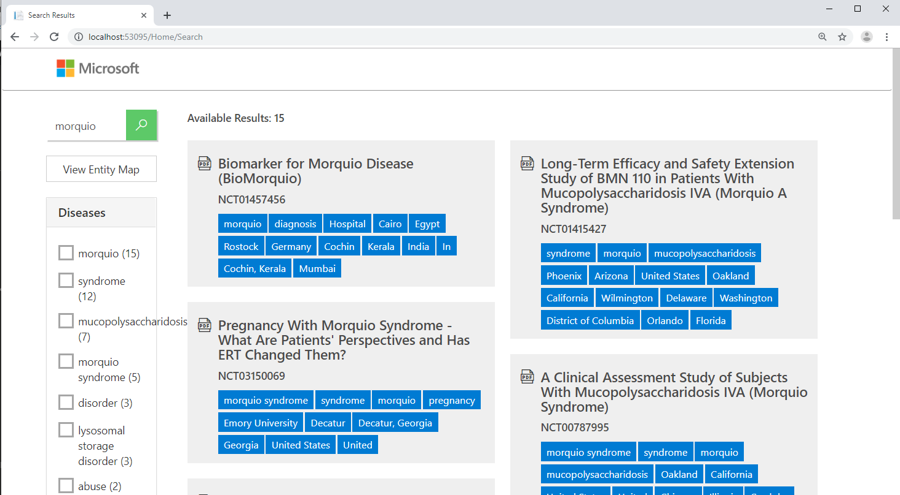
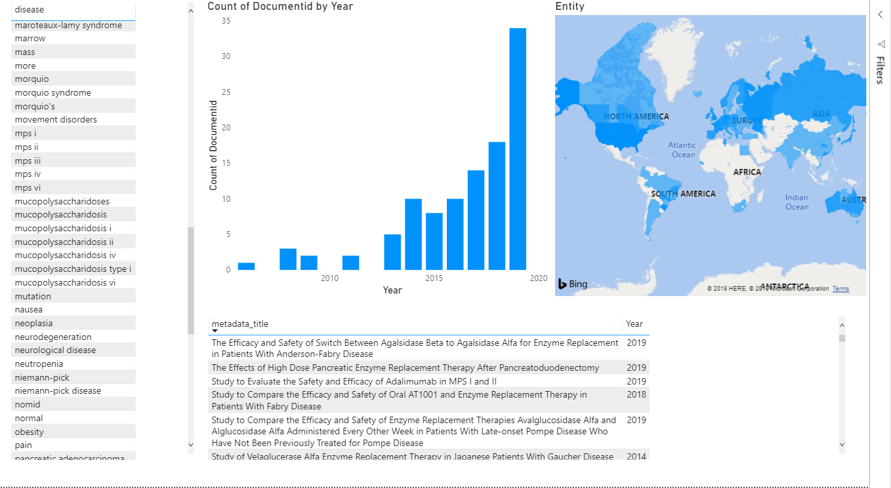

# Knowledge Mining Workshop

**Welcome to the Knowledge Mining workshop!** 

During this lab, we will be exploring a data set that is comprised of clinical trials in PDF format.  This demo data set contains over 100 records which contain complex medical terms and disease information in an unstructured format - meaning that there is no easy way to search the data set for information or records that pertain to a specific disease, like cirrhosis.  And worse yet, if (like the authors of this lab) you don't always accurately spell cirrhosis, you may have no way of ever finding the information you're looking for - structured or otherwise.

The challenge is, how can you take a vast amount of unstructured content and all of the latent data that it contains and provide an easy and effective way for a human to find the information that is most meaningful and relevant to them in the most efficient means possible?  Metaphorically, we are going to be finding meaning in information that starts out looking like this:

This is where the power of Knowledge Mining with Azure AI Search comes to the rescue.  Using the skills and techniques we'll be teaching you today, you will be able to quickly and easily ingest this content, build custom skills to identify and extract specific medical terms related to disease conditions and then either search for information through a web front end

or project the data into powerful visuals  you create in PowerBI.  

Along the way, we will also show you how easy and powerful it is to introduce more advanced search topics like phonetic search to your index (so that your users can find the information they are looking for regardless of their spelling skills) and boost relevancy of results.  The end result of today's workshop will be a fully searchable medical repository that will allow users to find and extract really powerful information, even if they are not trained medical professionals.  

More concretely, you'll learn how to build an Azure AI Search Index and Knowledge Store repository through the Azure Portal. From there, we'll explore more advanced concepts in Azure AI Search, build custom skills to extend the solution and create a basic web page front end to visualize your search results. Finally, you will build a PowerBI dashboard on top of your Knowledge Store to demonstrate how you can use your data store for data visualization and advanced analytics. We have also included an Optional Module 7 which is a stand alone module that will walk you through indexing data from an AzureSQL data source. We encourage you to walk through this module on your own time and review how this further extends the data available in your solution.

+ *Note: Please make sure to complete all of pre-requisites listed in Module 0 before moving on, as you will not be able to complete the exercises in this lab without them*.

## Agenda

+ [Module 0 - Pre-Requisites](./Module%200.md) (*you must complete prior to moving on!*)
+ [Module 1 - Using Azure Portal to Build a Search Index and Knowledge Store](./Module%201.md)
+ [Module 2 - Visualizing the Results with a Demo FrontEnd](./Module%202.md)
+ [Module 3 - Introduction to Custom Skills and Azure Functions](./Module%203.md)
+ [Module 4 - Learning the Object Model](./Module%204.md)
+ [Module 5 - Advanced Azure AI Search: Analyzers and Scoring Profiles](./Module%205.md)
+ [Module 6 - Analyzing Your Data with PowerBI](./Module%206.md)
+ [Module 7 - Using Azure AI Search to index structured data](./Module%207.md) (Optional)
